# Voice Voyage Chapter 3 Diagrams - Manuscript-Aligned Version

This Markdown file updates the Voice Voyage diagrams based on the Chapter 3 formatting pattern observed in the provided manuscript. The manuscript uses direct section headings, simple figure captions, and explanatory paragraphs beginning with phrases such as "Figure 2 shows..." or "Figure 3 illustrates..."

The attached manuscript was used only as a formatting reference. Its project-specific content about another system was not treated as an instruction for Voice Voyage.

## Recommended Chapter 3 Figure List

1. Figure 2. System Architecture
2. Figure 3. Software Architecture
3. Figure 4. Class Diagram
4. Figure 5. Use Case Diagram
5. Figure 6. Parent Sign-up and Child Screening Sequence Diagram
6. Figure 7. Speech Assessment Sequence Diagram
7. Figure 8. Adaptive Practice Plan Sequence Diagram
8. Figure 9. Gameplay Assessment Sequence Diagram
9. Figure 10. Speech Screening Flowchart Diagram
10. Figure 11. Practice Gameplay Flowchart Diagram
11. Figure 12. Error Handling Flowchart Diagram
12. Figure 13. Entity Relationship Diagram
13. Figure 14. Data Flow Diagram
14. Figure 15. Access Control Diagram
15. Figure 16. Deployment Diagram
16. Figure 17. Testing and Evaluation Flow Diagram
17. Figure 18. SDLC Agile Model

## System Architecture

Figure 2 shows the system architecture of Voice Voyage. The parent and child interact with the mobile application, while account access and stored records are handled through Firebase. The application sends recorded speech to the speech assessment service and sends screening findings to the adaptive practice plan service. The backend services use speech processing support, learning guides, and word lists to provide pronunciation feedback and personalized practice content.

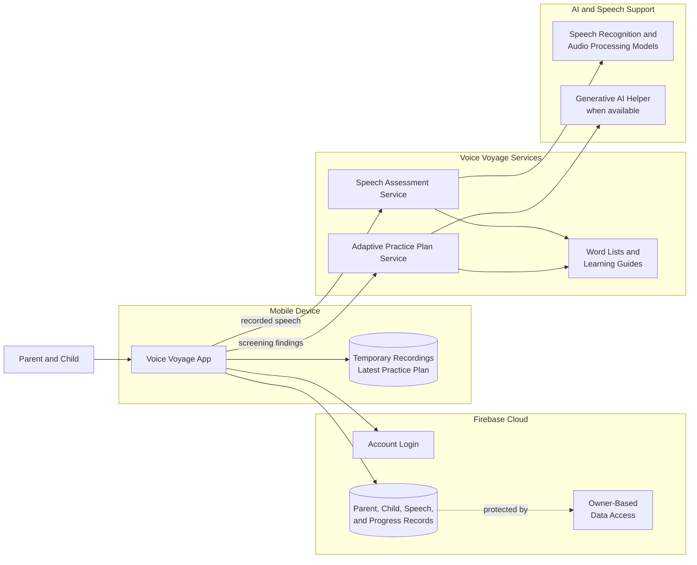

Figure 2. System Architecture

## Software Architecture

Figure 3 illustrates the software architecture of Voice Voyage. The application is divided into interface, control, service, and data layers. The interface layer contains the screens used by parents and children. The control layer manages user actions and screen flow. The service layer handles login, saved records, audio recording, speech assessment, practice plan requests, and local storage. The data layer contains the models used for parent accounts, child profiles, speech profiles, learning modules, reports, and game results.

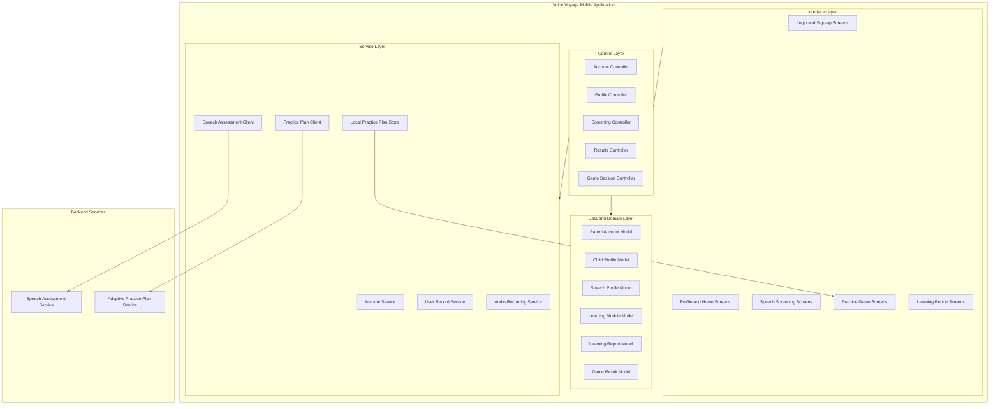

Figure 3. Software Architecture

## Class Diagram

Figure 4 presents the class diagram of Voice Voyage. It shows the major classes used to manage account access, child profiles, speech screening, learning results, and gameplay. Controller classes coordinate the application flow, service classes perform specific operations, and model classes represent the records used by the system.

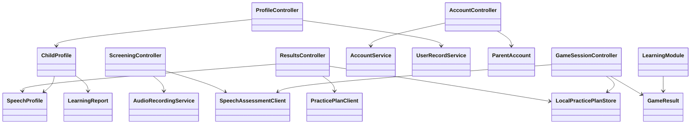

Figure 4. Class Diagram

## Use Case Diagram

Figure 5 illustrates the use case diagram of Voice Voyage. The Parent can create an account, manage the child profile, start screening, view progress, and review learning reports. The Child can complete speech screening and play practice activities. The system supports these actions by checking speech, generating practice plans, saving progress, and displaying feedback.

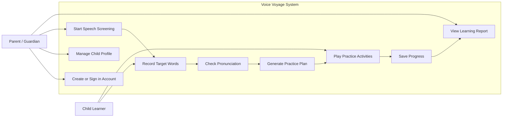

Figure 5. Use Case Diagram

## Sequence Diagram

Figure 6 shows how the parent sign-up and child screening process occurs in Voice Voyage. The parent enters account and child information, the system confirms the account, and the child completes the screening activity. The application sends the child's recorded speech to the assessment service, saves the results, requests a practice plan, and stores the child profile for future use.

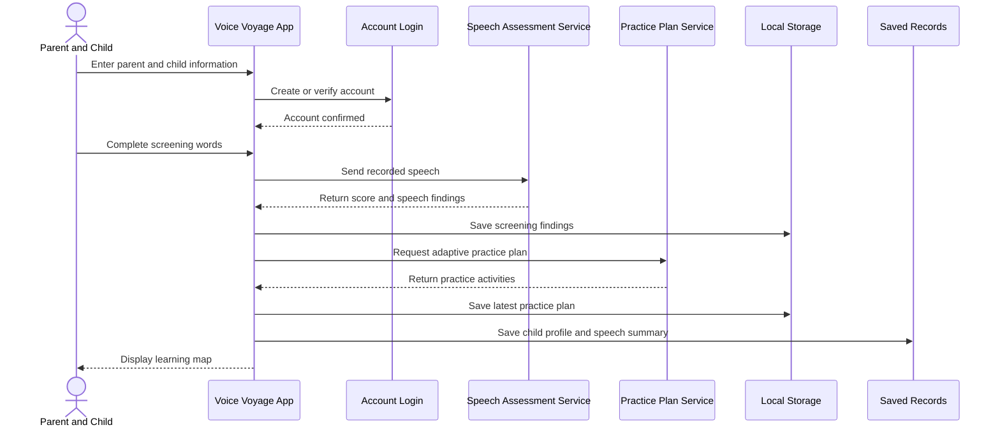

Figure 6. Parent Sign-up and Child Screening Sequence Diagram

Figure 7 shows how the speech assessment process works when the child records a target word. The application sends the target word, child age, and audio recording to the speech assessment service. The service checks if the recording is clear, compares it with the target pronunciation, prepares a score, and returns the result to the application.

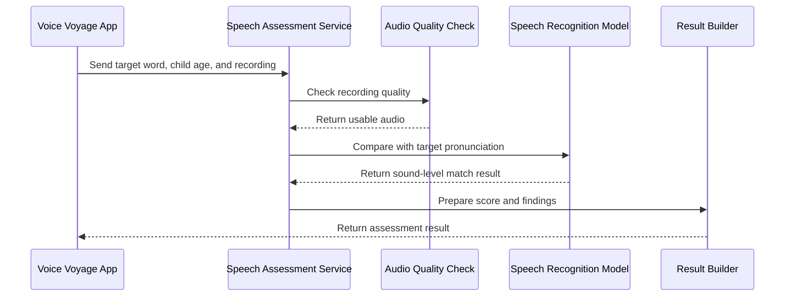

Figure 7. Speech Assessment Sequence Diagram

Figure 8 presents how Voice Voyage generates an adaptive practice plan. The application sends the child's age and detected speech needs to the practice plan service. The service selects suitable word lists and learning guides, uses an AI helper when available, validates the selected activities, and returns the practice plan to the application.

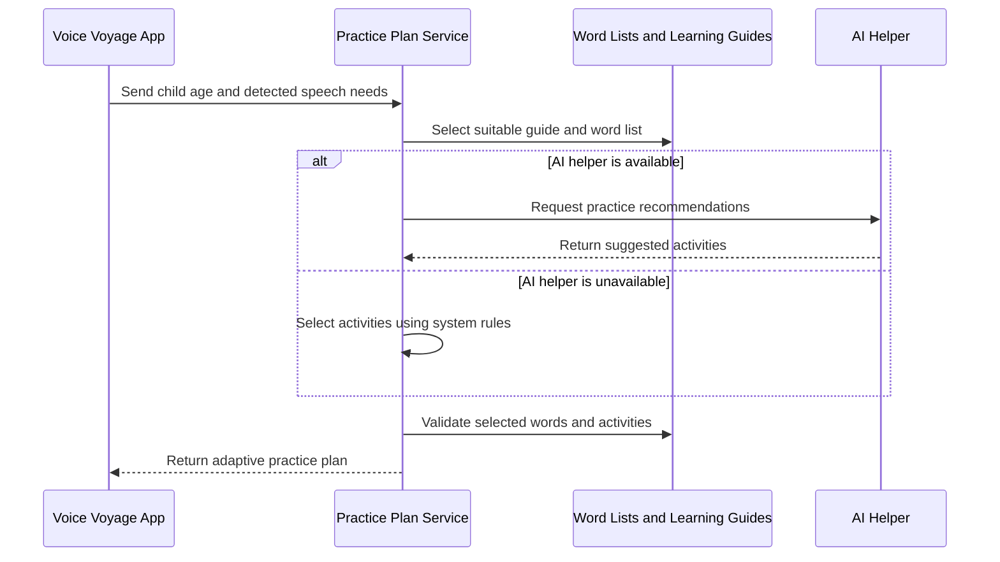

Figure 8. Adaptive Practice Plan Sequence Diagram

Figure 9 illustrates how gameplay uses the generated practice plan. The child starts a practice level, the application loads the latest practice plan, and the child completes the game task. If speech checking is required, the application sends the recording to the speech assessment service. The system then saves the result and updates the child's progress.

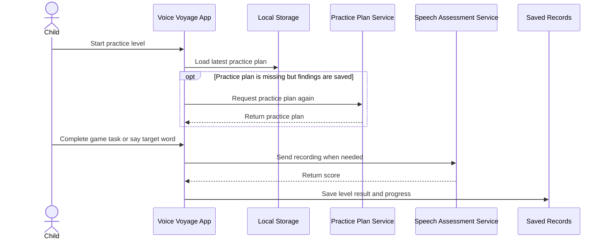

Figure 9. Gameplay Assessment Sequence Diagram

## Flowchart Diagram

Figure 10 shows the speech screening flowchart of Voice Voyage. The process starts when the parent or child opens the screening activity. The system presents a target word, records the child's speech, checks the pronunciation, and decides whether the recording is usable. If the recording is unclear, the child records again. If all screening words are completed, the system prepares the results and requests the adaptive practice plan.

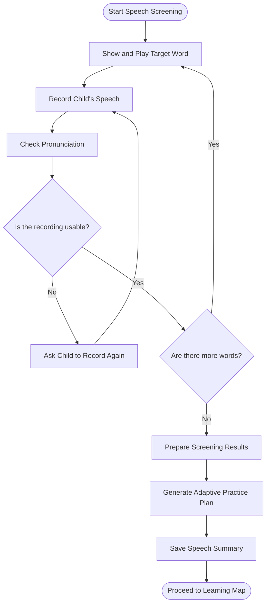

Figure 10. Speech Screening Flowchart Diagram

Figure 11 shows the practice gameplay flowchart of Voice Voyage. The child starts a practice activity, the system loads the latest practice plan, presents a target, checks the child's response when needed, and saves the result. If the child does not meet the required performance, the system allows another attempt before continuing.

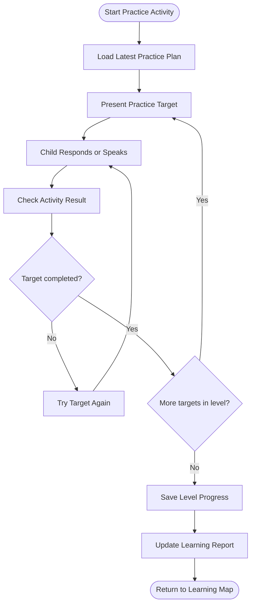

Figure 11. Practice Gameplay Flowchart Diagram

Figure 12 illustrates the error handling flowchart of Voice Voyage. The system checks whether the problem is caused by unclear audio, connection failure, or service unavailability. Audio problems lead to re-recording, while service problems may be retried. If the problem continues, the system shows a clear message and uses saved or built-in practice content when possible.

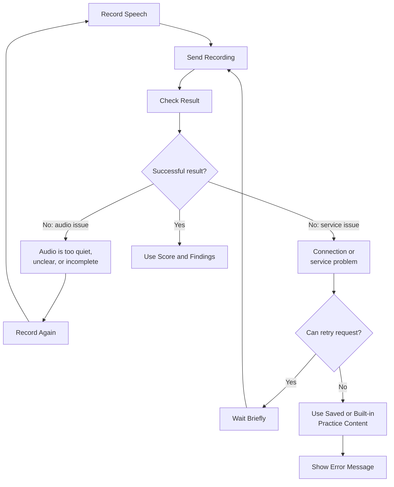

Figure 12. Error Handling Flowchart Diagram

## Entity Relationship Diagram

Figure 13 models the main records used by Voice Voyage. A parent account owns a parent record, and a parent record can manage one or more child profiles. Each child profile may have a speech profile, learning progress entries, and a learning report. This structure supports profile management, speech screening, adaptive practice, and progress monitoring.

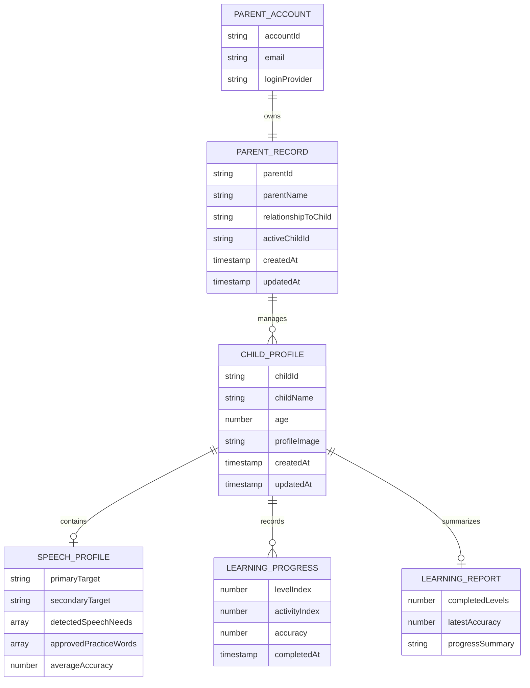

Figure 13. Entity Relationship Diagram

## Data Flow Diagram

Figure 14 shows the data flow of Voice Voyage from speech screening to practice and reporting. The child provides speech input during screening, the application sends the recording for assessment, and the returned findings are used to form the child's speech profile. These findings are then used to generate the adaptive practice plan. During gameplay, completed activities update the child's progress and learning report.

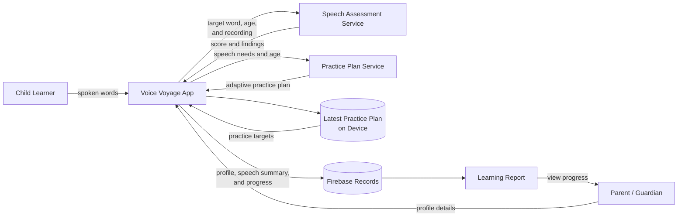

Figure 14. Data Flow Diagram

## Access Control Diagram

Figure 15 illustrates the access control design used to protect parent and child records. A parent must be signed in before opening or saving data. The system then checks whether the requested child profile or learning record belongs to the signed-in parent account. If the record does not belong to the account, access is denied.

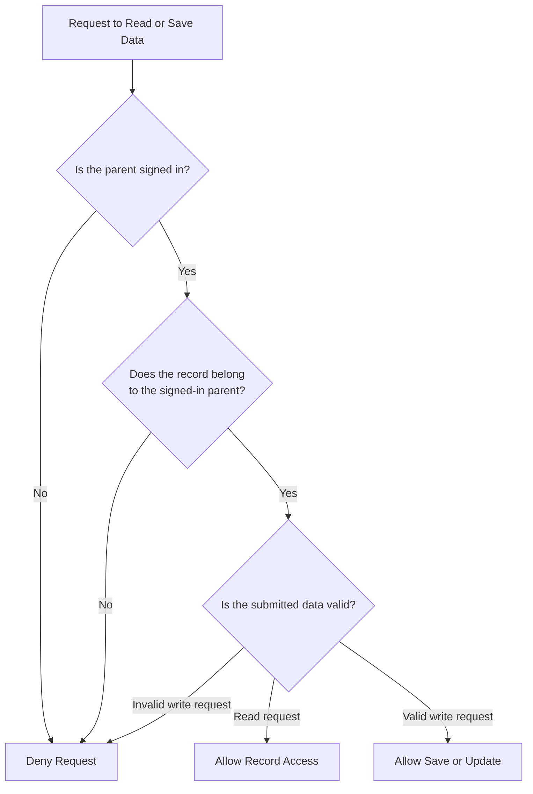

Figure 15. Access Control Diagram

## Deployment Diagram

Figure 16 presents the deployment design of Voice Voyage. The mobile application can be installed or tested on a user device, while Firebase provides cloud-based login and record storage. The speech assessment service and adaptive practice plan service are prepared as separate backend services so that each part can be tested locally and later hosted online.

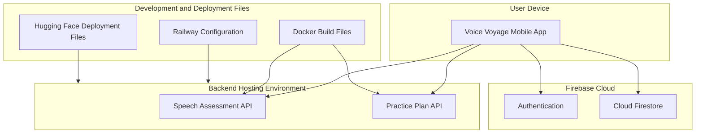

Figure 16. Deployment Diagram

## Testing and Evaluation Flow Diagram

Figure 17 shows the testing and evaluation flow for Voice Voyage. The researchers check core functions such as account access, child profile management, speech screening, adaptive practice generation, gameplay, and learning reports. After functional testing, the system can be evaluated by intended users and technical evaluators using usability and software quality criteria.

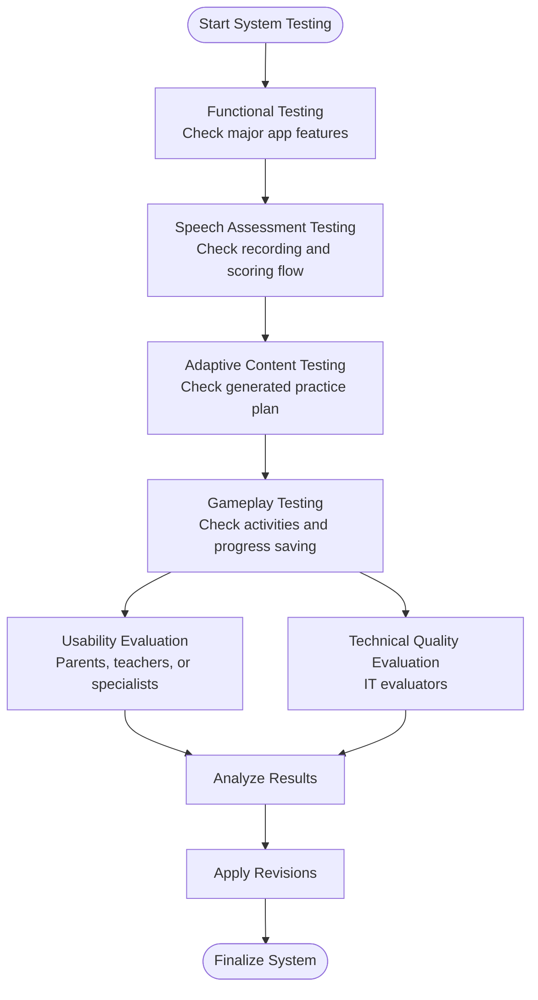

Figure 17. Testing and Evaluation Flow Diagram

## Methodology

Figure 18 shows the Agile Software Development Life Cycle used for the development of Voice Voyage. The process begins with planning the system requirements, followed by interface and system design, development of the application and backend services, testing of major functions, deployment preparation, and review based on feedback and evaluation results.

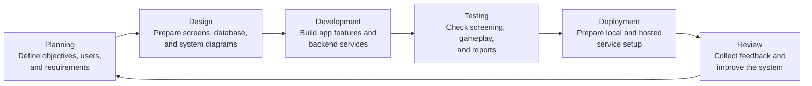

Figure 18. SDLC Agile Model
